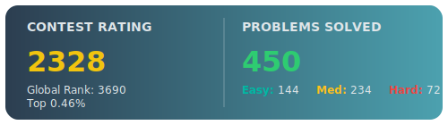

# 👋 Hi, I'm Tien Nguyen!

🎓 **Student @ University of Richmond**  
💻 **Passionate about coding, problem-solving, and making an impact through technology**

---

## 🛠️ Skills
- **Python:** AI and machine learning projects
- **C++:** Competitive programming and algorithms
- **Java:** Object-Oriented Programming

---

## 🏆 Achievements
- **13th Place:** ICPC Mid-Atlantic Region 2025 (Division 1)
- **7th Place:** ICPC Mid-Atlantic Region 2024

- **My LeetCode Status:**

  

---

## 🌱 Currently Working On
- **Argumentation Research**
- **Compactness Research**
- **Automation Project**

---

## 🤩 Hobbies & Interests
- 🏃 Running
- 🎹 Playing piano & guitar
- 📚 Reading
- 📸 Photography

---

## 🔗 Find Me Online
- [LinkedIn](https://www.linkedin.com/in/tiennc2310)
- [LeetCode](https://leetcode.com/u/NguyenTien7/)
- Contact me via Gmail: [viettien23102006@gmail.com](mailto:viettien23102006@gmail.com)
---

## 📢 Bio
I am an enthusiastic undergraduate eager for opportunities to join and contribute to impactful projects. I love learning new things and collaborating with others to solve challenging problems!

---

<!--
**tiennguyen2310/tiennguyen2310** is a ✨ special ✨ repository because its `README.md` (this file) appears on your GitHub profile.
-->
